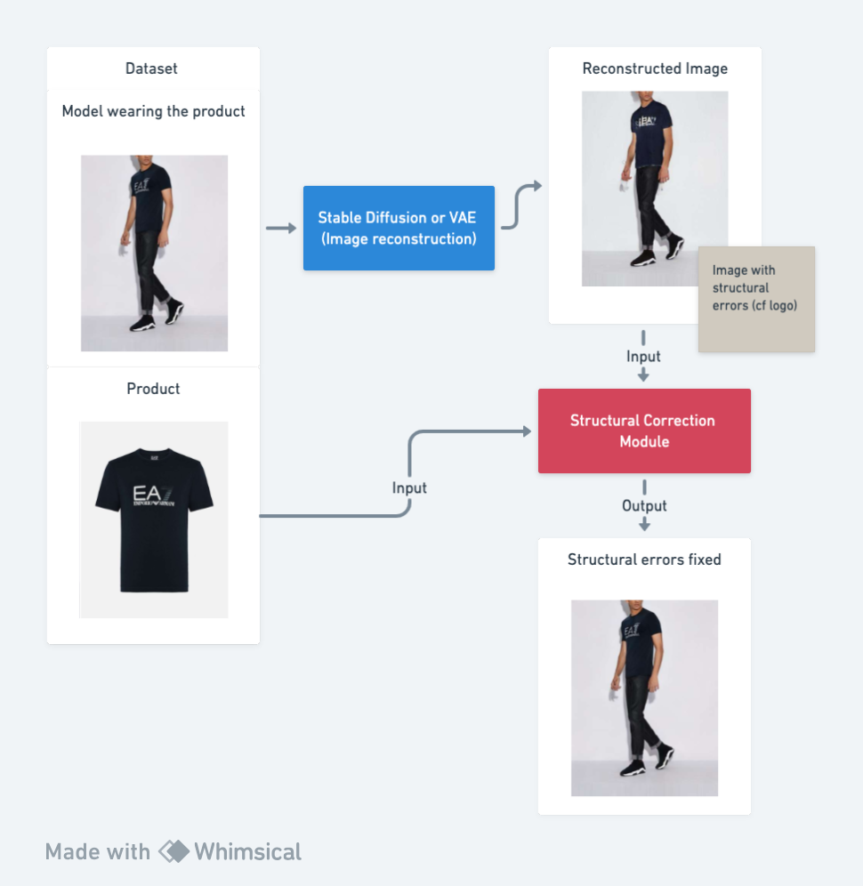
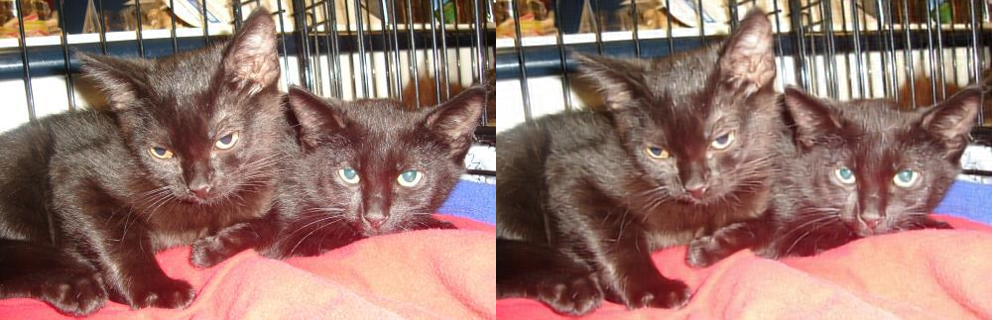
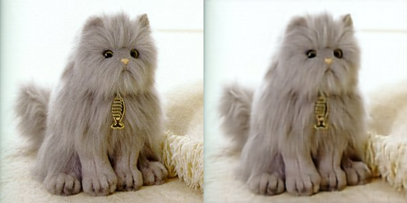

# Virtual Try-On: Details preservation

We have noticed that virtual try-on models struggle to preserve the details of the garments during reconstruction. That is why we want to work on this aspect, taking inspiration from the Structural-Correction Module from the paper [AutoDIR: Automatic All-in-One Image Restoration with Latent Diffusion](https://arxiv.org/abs/2310.10123).

## Table of Contents

- [Data](#data)
- [Approach](#approach)
- [Repository](#repository)

## Data

To train an SCM module, we need, for each instance, the image of the product, the image of the model wearing the product, and the image generated by a VTON module of the model wearing the product. Therefore, we will start from the base of the data set [VITON-HD](https://github.com/shadow2496/VITON-HD?tab=readme-ov-file).

## Approach

To create images of mannequins wearing the product with structural errors, we will use a Stable Diffusion model, allowing us to build our final dataset.

Once we have the data, we can train different architectures, drawing inspiration from the SCM of AutoDIR.

## Repository
Throughout this project, we will use the Refiners framework.
The current state of our repo corresponds to an upgrade we made in Deep Learning and Refiners.

We have coded an auto-encoder to reconstruct images of cats. Here are some results:

