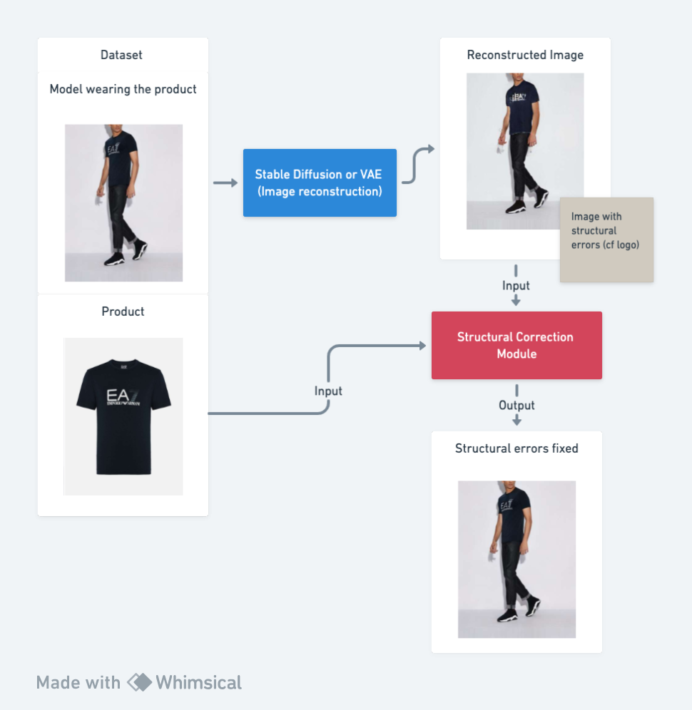
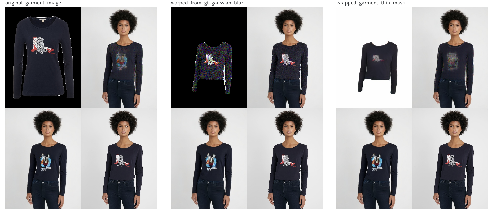
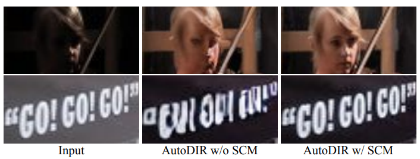
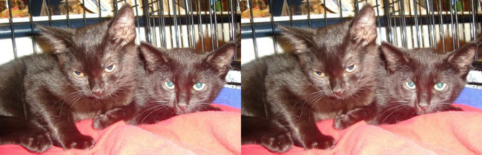
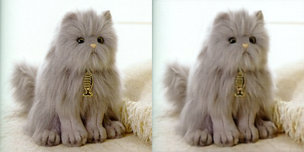

# Virtual Try-On: Details preservation

We have noticed that virtual try-on models struggle to preserve the details of the garments during reconstruction ([LaDI-VTON](https://github.com/miccunifi/ladi-vton/tree/master)). That is why we want to work on this aspect, taking inspiration from the Structural-Correction Module from the paper [AutoDIR: Automatic All-in-One Image Restoration with Latent Diffusion](https://arxiv.org/abs/2310.10123).

## Table of Contents

- [Dataset](#Dataset)
- [Approach](#Approach)
- [Results](#Results)
- [Repository Organisation](#Repository)

## Dataset

To train an SCM module, we need, for each instance, the image of the product, the image of the model wearing the product, and the image generated by a VTON module of the model wearing the product. Therefore, we used [VITON-HD](https://github.com/shadow2496/VITON-HD?tab=readme-ov-file) dataset and [LaDI-VTON](https://github.com/miccunifi/ladi-vton/tree/master) inference with pretrained models to generate images.

In order to build our dataset we followed the LaDI-VTON README instructions and we applied it on VITON-HD.

## Approach

- We implemented SCM from [AutoDIR](https://github.com/jiangyitong/AutoDIR) in [Refiners](https://github.com/finegrain-ai/refiners/tree/main) micro-framework. SCM is based on NAF-Net architecture.
- We validated our implementation to be sure we didn't make any mistakes translating the model
- We tested a lot of trainings configurations using different inputs as context image (original garment, warped garment produced by LaDI-VTON, warped garment taken from ground truth with gaussian noise degradation)
- Qualitative and quantitative evaluation of our trained models

## Results

The results are not completely satisfying, we believed virtual-try-on is a use case difficult to transpose to the AutoDIR SCM problem. AutoDIR SCM take as input two almost identical images that can be superposed, and this is why we tested the warped garments:

In virtual-try-on tasks is very hard to have almost two identical images to fix structural errors on the garment...

## Repository Organisation

The repository is divided in three sections corresponding to the chronological milestones:

- First a [ramp_up](ramp_up) folder. Here we have compiled all the work done during our ramp up in deep learning and refiners framework. Basically we learned the basics by coding an autoencoder to reconstruct cat images

- Then we tried to use a variational autoencoder ([vae](vae) folder) to build our dataset with structural errors. At that time, we weren't aware LaDI-VTON released pretrained models. This is why we tested this alternative approach but we didn't manage to train correctly the VAE because of high computational cost.

- Finally, [scm](scm) folder where you will find our implementation, training scripts and dataset object. This is the main contribution of this project.

